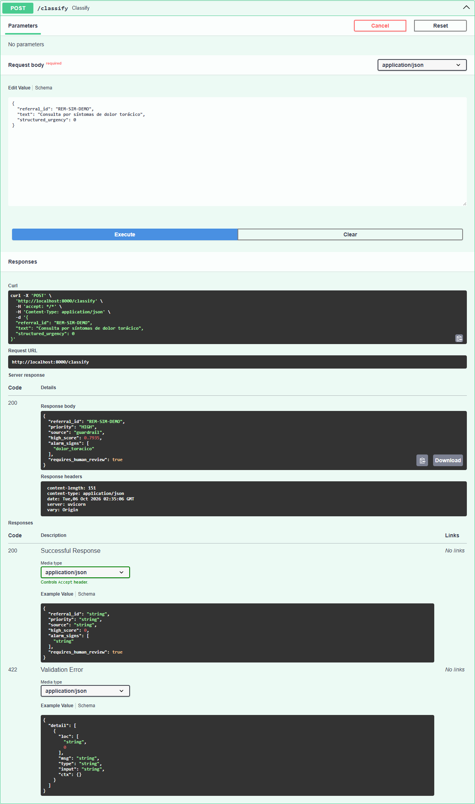
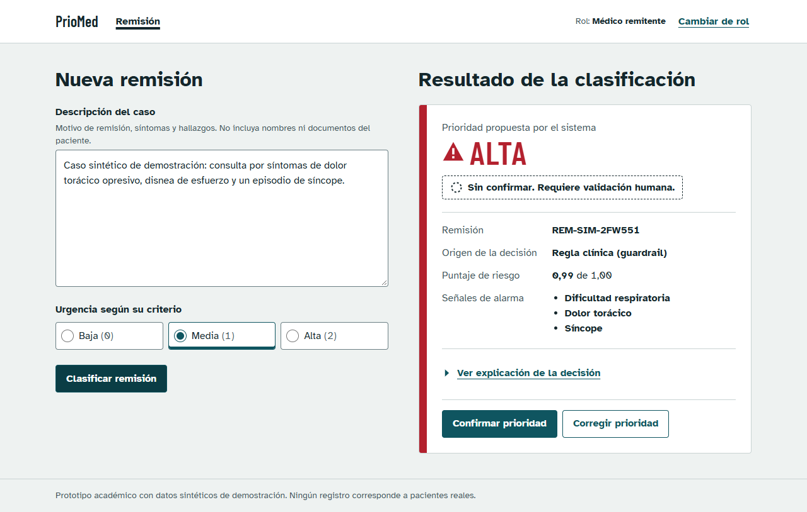

# priomed-classification-service

Servicio de clasificación de prioridad de remisiones a consulta especializada — componente
**Classification Service** de PrioMed (Secciones 5–7 del artículo del proyecto).

## Foco técnico del proyecto

> **Atributo de calidad: sensibilidad diferencial en casos de alta severidad (seguridad clínica).**
> Problema técnico: *controlar con garantía estadística la tasa de subtriaje de los casos críticos*
> (HIGH clasificado como no-HIGH), aceptando más falsas alarmas a cambio, porque los dos errores
> no cuestan lo mismo.

El estado del arte (Sección 3 del artículo) muestra que los modelos fallan justo en los casos
graves (p. ej. sensibilidad 54.2 % vs. especificidad 80.1 % en cirugía cardiaca). Este repo
implementa y evalúa tres capas para atacar ese problema:

| Capa | Módulo | Qué hace |
|---|---|---|
| Guardrail de reglas (Alternativa A) | `alarm_extractor.py` | Diccionario + manejo de negación; una señal de alarma activa fuerza prioridad HIGH |
| ML clásico (Alternativa B) | `model.py` | TF-IDF + regresión logística; P(HIGH) como puntaje de riesgo |
| Umbral Neyman–Pearson | `np_threshold.py` | Elige el umbral sobre P(HIGH) para que la tasa de omisión sea ≤ α con confianza ≥ 1 − δ |

La explicación con LLM (Alternativa C) y la validación humana viven en otros componentes; este
servicio siempre devuelve `requires_human_review = true`.

## Uso

```bash
pip install -e ".[dev]"
pytest -q                          # 16 pruebas, incluida cobertura empírica de la garantía NP
python scripts/run_evaluation.py   # comparación de 6 estrategias -> reports/evaluation_report.md
uvicorn priomed_classification.api:app --reload
```

```bash
curl -X POST localhost:8000/classify -H 'content-type: application/json' \
  -d '{"referral_id":"r1","text":"Paciente con dolor toracico","structured_urgency":0}'
```

### CORS

Para que el frontend (`priomed-frontend`) llame la API desde el navegador, el servicio autoriza por
defecto los orígenes `http://localhost:5173` y `http://localhost:4173`. Para otros orígenes, defina
`PRIOMED_CORS_ORIGINS` con una lista separada por comas:

```bash
PRIOMED_CORS_ORIGINS="https://priomed.example" uvicorn priomed_classification.api:app
```

## Verificación del servicio en ejecución

Capturas tomadas el 5 de octubre de 2026 con el servicio corriendo en `localhost:8000`
(`pytest -q`: 16 pruebas aprobadas). Los casos son sintéticos.

**`POST /classify` desde Swagger UI (`/docs`).** El texto «Consulta por síntomas de dolor torácico»
activa el guardrail: la palabra «síntomas» ya no se confunde con la negación «sin».



**Integración con `priomed-frontend`.** El frontend, servido desde `localhost:4173`, llama a este
servicio por CORS y muestra su respuesta; la prioridad queda sin confirmar hasta la validación humana.



## Resultados preliminares (SINTÉTICOS — leer antes de citar)

Corrida por defecto (α = 0.05, δ = 0.05, semilla 7, 3000 remisiones de prueba):

| Estrategia | Sens. HIGH | Sens. desajuste | Falsa alarma HIGH | Subtriaje |
|---|---|---|---|---|
| S0 urgencia estructurada del médico | 0.755 | 0.000 | 0.038 | 0.052 |
| S1 solo reglas (A) | 0.915 | 0.741 | 0.041 | 0.032 |
| S2 ML argmax (B) | 0.899 | 0.877 | 0.005 | 0.027 |
| S3 ML + umbral NP | 0.971 | 1.000 | 0.032 | 0.017 |
| S5 guardrail + ML + NP | 0.971 | 1.000 | 0.032 | 0.017 |

Lectura honesta:

- El umbral NP sube la sensibilidad de HIGH de ~0.90 a ~0.97 y cumple la meta del Escenario 1
  (≥ 95 %), a costa de ~3 % de falsas alarmas (el ML con argmax tenía 0.5 %).
- En estos datos el guardrail **no mejora** la sensibilidad sobre ML + NP (S5 = S3). Su valor aquí
  es de **independencia y auditabilidad** (no depende del modelo), no de métrica; hay que probarlo
  con datos donde el modelo falle de verdad.
- **Limitación central:** los datos son sintéticos y las etiquetas salen de la misma taxonomía que
  usa el guardrail, así que la evaluación es en parte circular. Valida el *mecanismo* (la garantía
  NP se verifica empíricamente en `tests/test_np_threshold.py`), **no** el desempeño clínico real.
- La taxonomía motivo → severidad es una hipótesis de trabajo y requiere validación clínica.

## Próximos pasos

- Reemplazar datos sintéticos por datos abiertos / anonimizados (RIPS, SISPRO) y calibrar con el
  Anexo Técnico del MGTE.
- Medir sensibilidad por motivo de consulta y no solo agregada (el hallazgo del artículo es que el
  error es *diferencial*).
- Comparar contra clasificación jerárquica NP multiclase (ver `docs/` en `priomed-docs`).
